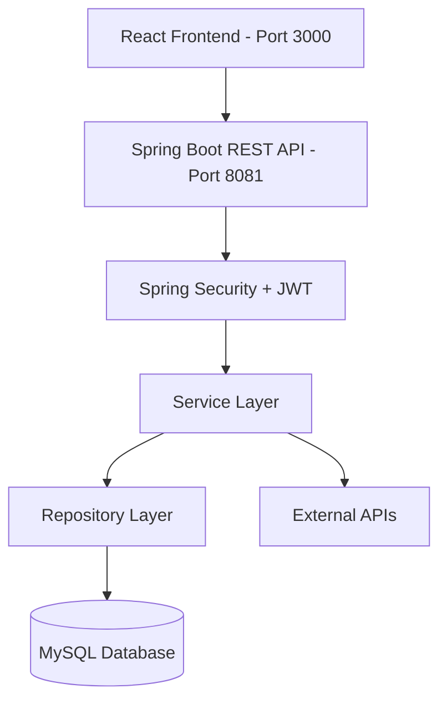
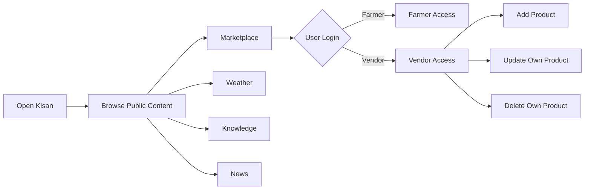
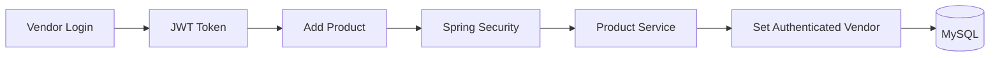

# Kisan – Smart Agriculture Marketplace & Farmer Support Platform


Kisan is a full-stack smart agriculture platform designed to provide farmers
with useful agricultural information, weather insights, crop recommendations,
marketplace access, suppliers, and transportation options through a single
web application.

The platform combines a Spring Boot REST API backend with a React-based
frontend. It provides public access to agricultural information and marketplace
browsing while using JWT-based authentication and role-based authorization for
protected operations.

The system supports three roles: **FARMER, VENDOR, and ADMIN**. Farmers can
browse agricultural products and access farming information, vendors can
manage their own marketplace products, and administrators are created and
managed through the backend.

---

## Table of Contents

* [Project Overview](#project-overview)
* [Architecture Overview](#architecture-overview)
* [Project Structure](#project-structure)
* [Technology Stack](#technology-stack)
* [Features](#features)
* [Project Workflow](#project-workflow)
* [Authentication and Authorization](#authentication-and-authorization)
* [Frontend](#frontend)
* [Database](#database)
* [API Overview](#api-overview)
* [Project Journey](#project-journey)
* [Development Methodology](#development-methodology)
* [Testing](#testing)
* [Configuration](#configuration)
* [Build and Run](#build-and-run)
* [API Testing](#api-testing)
* [Future Improvements](#future-improvements)
* [Key Design Decisions](#key-design-decisions)
* [Repository Guidelines](#repository-guidelines)
* [Contribution](#contribution)
* [License](#license)

---

# Project Overview

## Purpose

Agricultural users often need information from multiple sources for weather,
crop planning, agricultural products, suppliers, and transportation.

Kisan brings these capabilities together into one platform.

The application provides:

* Agricultural marketplace browsing
* Vendor product management
* Weather information
* Crop recommendations
* Agricultural knowledge and disease information
* Government scheme and news information
* Supplier information
* Transportation options
* Secure user authentication
* Role-based access control

The application is designed with a clear separation between frontend,
backend, business logic, persistence, and external services.

## Current Status

The core application is functional and currently includes:

* React frontend
* Spring Boot REST backend
* MySQL persistence
* User registration and login
* JWT authentication
* Role-based authorization
* Farmer and vendor registration
* Vendor-only product creation
* Vendor-owned product update and deletion
* Public marketplace browsing
* Search, filtering, and sorting
* Weather integration
* Agricultural information pages
* Supplier and transportation sections
* Centralized API communication through Axios

Further improvements such as containerization, CI/CD, cloud deployment,
advanced monitoring, and additional agricultural intelligence are planned.

---

# Architecture Overview

Kisan follows a layered full-stack architecture.



The frontend communicates with the backend through REST APIs.

The backend follows a layered architecture:

```text
Controller
    ↓
Service
    ↓
Repository
    ↓
Database
```

DTOs and mappers are used between the API layer and persistence models.

---

# Project Structure

```text
Kisan
│
├── client/
│   └── React frontend
│
├── server/
│   └── kisan-server/
│       │
│       ├── src/
│       │   ├── main/
│       │   │   ├── java/
│       │   │   │   └── com/kisan/
│       │   │   │       ├── config/
│       │   │   │       ├── controller/
│       │   │   │       ├── dto/
│       │   │   │       ├── exception/
│       │   │   │       ├── mapper/
│       │   │   │       ├── model/
│       │   │   │       ├── repository/
│       │   │   │       ├── security/
│       │   │   │       └── service/
│       │   │   │
│       │   │   └── resources/
│       │   │       └── application.properties
│       │   │
│       │   └── test/
│       │
│       └── pom.xml
│
└── README.md
```

### Backend Packages

| Package      | Responsibility                                            |
| ------------ | --------------------------------------------------------- |
| `controller` | REST API endpoints and HTTP request handling.             |
| `service`    | Business logic and application rules.                     |
| `repository` | Database access through Spring Data JPA.                  |
| `model`      | JPA entities representing database tables.                |
| `dto`        | Request and response data transfer objects.               |
| `mapper`     | Converts entities to DTOs and DTOs to entities.           |
| `security`   | JWT generation, validation, and authentication filtering. |
| `config`     | Spring Security, CORS, and application configuration.     |
| `exception`  | Custom exceptions and centralized error handling.         |

---

# Technology Stack

| Technology            | Purpose                                   |
| --------------------- | ----------------------------------------- |
| Java 24               | Primary programming language and runtime. |
| Spring Boot 3.5.7     | Backend REST API framework.               |
| Spring Security 6.5.6 | Authentication and authorization.         |
| Spring Data JPA       | Database access abstraction.              |
| Hibernate             | ORM implementation used by JPA.           |
| MySQL                 | Relational database.                      |
| React                 | Frontend framework.                       |
| JavaScript            | Frontend application logic.               |
| Axios                 | HTTP client used by React.                |
| JSON Web Token        | Stateless authentication.                 |
| JJWT 0.12.6           | JWT generation and validation library.    |
| BCrypt                | Password hashing.                         |
| Maven                 | Backend build and dependency management.  |
| HTML/CSS              | Frontend structure and styling.           |
| Bootstrap             | Responsive layout utilities.              |
| JUnit                 | Automated testing.                        |
| Mockito               | Mocking and unit testing.                 |
| Postman               | API testing and validation.               |
| Git/GitHub            | Version control and collaboration.        |

---

# Features

## User Authentication

* User registration
* User login
* Password hashing using BCrypt
* JWT-based authentication
* Stateless authentication
* Persistent login state through browser storage
* Logout functionality

## Role-Based Access Control

Kisan supports three roles:

| Role     | Access                                                  |
| -------- | ------------------------------------------------------- |
| `FARMER` | Browse marketplace and access agricultural information. |
| `VENDOR` | All public functionality plus product management.       |
| `ADMIN`  | Backend-managed administrative role.                    |

Public users can browse marketplace information without logging in.

Registration allows users to select only:

* Farmer
* Vendor

Administrator accounts are not publicly registered. They are created by the
backend using configured administrator credentials.

---

# Marketplace

The marketplace allows users to browse agricultural products.

Users can:

* View available products
* Search products by name
* Filter products by category
* Sort products by price
* Sort products by name
* View product details
* Browse suppliers
* Browse transportation options

Vendors can additionally:

* Add products
* Edit their own products
* Delete their own products

A vendor cannot update or delete another vendor's product.

Product ownership is enforced on the backend rather than relying only on
frontend visibility.

---

# Weather

The weather module provides weather information based on the selected
location.

The frontend sends the requested location to the Spring Boot backend, which
handles the external weather API integration and returns structured weather
data to the React application.

The application displays information such as:

* Location
* Temperature
* Weather condition

---

# Crop Recommendations

The crop recommendation functionality is designed to assist farmers in
selecting suitable crops based on agricultural conditions such as:

* Soil information
* Climate
* Season

The feature is intended to provide practical agricultural guidance through the
platform.

---

# Agricultural Knowledge

The knowledge section provides agricultural information including:

* Crop-related knowledge
* Disease information
* Farming skills
* Agricultural guidance

The platform also provides access to agricultural news and information about
government schemes.

---

# Suppliers and Transportation

The marketplace contains dedicated sections for:

### Suppliers

Users can browse supplier information and available agricultural resources.

### Transportation

Users can browse transportation options that can help move agricultural
products and supplies.

These sections are publicly accessible.

---

# Project Workflow

The general application flow is:



### Vendor Product Workflow



For update and delete operations, the backend verifies that the authenticated
vendor owns the requested product.

---

# Authentication and Authorization

Kisan uses stateless JWT authentication.

The authentication flow is:

```text
User
  ↓
Login
  ↓
Spring Boot Authentication
  ↓
BCrypt Password Verification
  ↓
JWT Generated
  ↓
React Stores Token
  ↓
Axios Adds Bearer Token
  ↓
JWT Authentication Filter
  ↓
User Loaded From Database
  ↓
SecurityContext
  ↓
Role-Based Authorization
```

The frontend stores the following information after login:

```text
token
userId
name
role
```

Axios automatically attaches the JWT to protected API requests:

```text
Authorization: Bearer <JWT>
```

The backend JWT filter:

1. Reads the `Authorization` header.
2. Checks for the `Bearer` prefix.
3. Extracts the JWT.
4. Extracts the user's email.
5. Loads the user from the database.
6. Validates the token.
7. Creates a Spring Security authentication object.
8. Adds the user's role as a granted authority.

Roles are represented internally using:

```text
ROLE_FARMER
ROLE_VENDOR
ROLE_ADMIN
```

Spring Security then enforces authorization rules.

For example:

```text
POST /api/products
        ↓
      VENDOR
        ↓
   Product Service
```

A farmer attempting to create a product is rejected by backend security.

---

# Frontend

The frontend is implemented using React.

Main routes include:

```text
/
├── /register
├── /login
├── /marketplace
├── /weather
├── /news
├── /knowledge
├── /contact
└── /about
```

The React application uses an `AuthContext` to manage authentication state.

The context provides:

* Current user
* Login
* Logout
* Authentication status

The navigation bar dynamically displays options based on authentication
status.

For authenticated users it displays:

```text
Welcome, <name>
Logout
```

For unauthenticated users it displays:

```text
Login
Register
```

---

# API Communication

Axios is centralized through an API configuration.

```text
React
  ↓
Axios
  ↓
http://localhost:8081/api
  ↓
Spring Boot
```

The Axios interceptor automatically reads the JWT from browser storage and
adds it to requests when available.

Example:

```text
GET /products

POST /products

PUT /products/{id}

DELETE /products/{id}
```

The frontend therefore does not need to manually construct the full backend
URL for every request.

---

# Database

Kisan uses MySQL with Spring Data JPA and Hibernate.

The primary user table contains information such as:

| Field      | Description               |
| ---------- | ------------------------- |
| `id`       | Unique user identifier.   |
| `name`     | User's name.              |
| `email`    | Unique email address.     |
| `password` | BCrypt-hashed password.   |
| `location` | User's location.          |
| `role`     | FARMER, VENDOR, or ADMIN. |

The product entity contains:

| Field         | Description                  |
| ------------- | ---------------------------- |
| `id`          | Product identifier.          |
| `name`        | Product name.                |
| `category`    | Product category.            |
| `price`       | Product price.               |
| `location`    | Product location.            |
| `description` | Product description.         |
| `vendor_id`   | Vendor who owns the product. |

The vendor relationship is represented using JPA:

```text
User
  1
  |
  | owns
  |
  *
Product
```

This relationship allows the backend to enforce product ownership.

---

# API Overview

## Authentication

| Method | Endpoint        | Access |
| ------ | --------------- | ------ |
| `POST` | `/api/register` | Public |
| `POST` | `/api/login`    | Public |

## Products

| Method   | Endpoint             | Access |
| -------- | -------------------- | ------ |
| `GET`    | `/api/products`      | Public |
| `GET`    | `/api/products/{id}` | Public |
| `POST`   | `/api/products`      | Vendor |
| `PUT`    | `/api/products/{id}` | Vendor |
| `DELETE` | `/api/products/{id}` | Vendor |

## Suppliers

| Method | Endpoint              | Access |
| ------ | --------------------- | ------ |
| `GET`  | `/api/suppliers`      | Public |
| `GET`  | `/api/suppliers/{id}` | Public |

## Transportation

| Method | Endpoint                 | Access |
| ------ | ------------------------ | ------ |
| `GET`  | `/api/transporters`      | Public |
| `GET`  | `/api/transporters/{id}` | Public |

## News

| Method | Endpoint         | Access |
| ------ | ---------------- | ------ |
| `GET`  | `/api/news`      | Public |
| `GET`  | `/api/news/{id}` | Public |

## Knowledge

| Method | Endpoint                  | Access |
| ------ | ------------------------- | ------ |
| `GET`  | `/api/knowledge/diseases` | Public |
| `GET`  | `/api/knowledge/skills`   | Public |

## Contact

| Method | Endpoint        | Access |
| ------ | --------------- | ------ |
| `POST` | `/api/messages` | Public |

---

# Project Journey

The Kisan application was developed incrementally.

## Initial Development

The project started as a Spring Boot backend and React frontend with
functionality for agricultural information and marketplace operations.

## Backend Refactoring

The backend was progressively reorganized into a layered architecture:

```text
Controller
    ↓
Service
    ↓
Repository
    ↓
Model
```

DTOs and mappers were introduced to keep API models separate from database
entities.

Validation and centralized exception handling were also introduced.

## Authentication

User registration and login were implemented with:

* BCrypt password hashing
* User roles
* Login response DTOs
* JWT authentication
* Spring Security

## Role-Based Authorization

The application was extended to distinguish:

```text
FARMER
VENDOR
ADMIN
```

Vendor-specific product operations were then protected using Spring Security.

## Product Ownership

Product management was enhanced so that vendors can modify or delete only
products belonging to them.

Ownership is checked on the backend using the authenticated user.

## Frontend Authentication

React authentication state was centralized using `AuthContext`.

The application now maintains login state, displays the logged-in user's
name, and provides logout functionality.

## API Client

Axios was centralized into a reusable API client with an interceptor that
automatically attaches JWT tokens.

---

# Development Methodology

The project is developed incrementally using a feature-based approach.

Development generally follows:

```text
Requirement
    ↓
Backend API
    ↓
Service Logic
    ↓
Database
    ↓
Security
    ↓
Frontend Integration
    ↓
Testing
    ↓
UI Refinement
```

Changes are implemented in small, testable steps rather than rewriting large
parts of the application.

Git is used for version control and feature development.

---

# Testing

Testing combines automated and manual validation.

| Type                    | Tool            | Purpose                                       |
| ----------------------- | --------------- | --------------------------------------------- |
| Unit testing            | JUnit           | Test individual application components.       |
| Mock testing            | Mockito         | Test business logic with mocked dependencies. |
| API testing             | Postman         | Test REST endpoints.                          |
| Manual frontend testing | Browser         | Validate React functionality and UI behavior. |
| Security testing        | Browser/Postman | Verify authentication and role-based access.  |

Important security scenarios include:

* Farmer cannot add a product.
* Vendor can add a product.
* Vendor can update their own product.
* Vendor can delete their own product.
* Vendor cannot update another vendor's product.
* Vendor cannot delete another vendor's product.
* Public users can browse products.
* Protected requests require a valid JWT.

---

# Configuration

Environment-specific and sensitive values should not be hardcoded into the
application.

For example:

```properties
weather.api.key=${WEATHER_API_KEY}
weather.api.url=${WEATHER_API_URL}
```

Administrator credentials are also configured through environment variables:

```text
ADMIN_EMAIL
ADMIN_PASSWORD
```

The application reads these values during startup.

Sensitive configuration files such as `.env` should not be committed to Git.

---

# Build and Run

## Prerequisites

Install the following:

* Java 24
* Maven
* MySQL
* Node.js
* npm
* Git

Verify Java:

```bash
java -version
```

Verify Maven:

```bash
mvn -version
```

Verify Node.js:

```bash
node -v
```

---

## Clone Repository

```bash
git clone <YOUR_GITHUB_REPOSITORY_URL>
cd Kisan
```

---

## Database Setup

Create the MySQL database:

```sql
CREATE DATABASE kisan;
```

Configure the database connection in the backend configuration.

Example:

```properties
spring.datasource.url=jdbc:mysql://localhost:3306/kisan
spring.datasource.username=${DB_USERNAME}
spring.datasource.password=${DB_PASSWORD}
```

---

# Backend

Navigate to the backend:

```bash
cd server/kisan-server
```

Build the project:

```bash
mvn clean install
```

Run the application:

```bash
mvn spring-boot:run
```

The backend runs on:

```text
http://localhost:8081
```

The REST API base URL is:

```text
http://localhost:8081/api
```

---

# Frontend

Navigate to the React application:

```bash
cd client
```

Install dependencies:

```bash
npm install
```

Start the development server:

```bash
npm start
```

The frontend runs on:

```text
http://localhost:3000
```

---

# Running the Application

Start the services in the following order:

```text
MySQL
   ↓
Spring Boot Backend
   ↓
React Frontend
```

Then open the application in the browser:

```text
http://localhost:3000
```

---

# API Testing

Postman can be used to test the backend independently of the React frontend.

A typical authentication flow is:

```text
1. Register
      ↓
2. Login
      ↓
3. Receive JWT
      ↓
4. Send JWT as Bearer token
      ↓
5. Access protected endpoint
```

Example authorization header:

```text
Authorization: Bearer <JWT>
```

For example, a vendor can call:

```text
POST /api/products
```

with a valid vendor JWT.

A farmer attempting the same operation should receive an authorization
failure.

---

# Future Improvements

The following improvements are planned for future versions.

| Area              | Planned Improvement                                          |
| ----------------- | ------------------------------------------------------------ |
| Docker            | Containerize frontend, backend, and database.                |
| Docker Compose    | Run the complete application stack with one command.         |
| CI/CD             | Automate build, testing, and deployment pipelines.           |
| AWS               | Deploy the application using AWS cloud infrastructure.       |
| Kubernetes        | Add container orchestration and scaling.                     |
| Kafka             | Introduce event-driven communication for selected workflows. |
| Monitoring        | Add application metrics and health monitoring.               |
| Logging           | Introduce centralized logging.                               |
| Testing           | Increase automated unit and integration test coverage.       |
| JWT               | Improve token lifecycle management with refresh tokens.      |
| Admin Dashboard   | Add a dedicated administrative interface.                    |
| Marketplace       | Add ordering, cart, and transaction functionality.           |
| Crop Intelligence | Improve crop recommendations using richer agricultural data. |
| Mobile            | Improve responsive/mobile-first experience.                  |

---

# Key Design Decisions

## Layered Backend Architecture

The backend uses:

```text
Controller → Service → Repository
```

This keeps HTTP handling, business logic, and persistence responsibilities
separate.

## DTO-Based API

DTOs are used instead of exposing JPA entities directly through REST APIs.

This provides better control over:

* API responses
* Input validation
* Security
* Entity/API separation

## JWT Authentication

JWT was selected to provide stateless authentication suitable for a REST API
and modern frontend application.

## Backend Authorization

Security decisions are enforced by Spring Security on the backend.

Frontend role checks are used to improve the user experience, but they are not
treated as the security boundary.

## Product Ownership

A vendor is associated with each product.

When modifying or deleting a product, the backend compares the authenticated
vendor's ID with the product owner's ID.

```text
Authenticated Vendor ID
          ↓
      Compare
          ↓
Product Vendor ID
          ↓
       Match?
      /      \
    Yes       No
     ↓         ↓
  Allow      Reject
```

---

# Repository Guidelines

The following files should not be committed:

```text
.env
target/
node_modules/
```

Environment variables and secrets should be stored outside source control.

Sensitive credentials such as:

```text
DB_PASSWORD
WEATHER_API_KEY
ADMIN_PASSWORD
JWT_SECRET
```

must never be hardcoded into the repository.

Generated build files should also remain excluded from Git.

---

# Contribution

Contributions can be made through the following workflow:

```text
Create Feature Branch
        ↓
Implement Change
        ↓
Test Locally
        ↓
Commit Changes
        ↓
Push Branch
        ↓
Create Pull Request
        ↓
Review
        ↓
Merge
```

Before submitting changes:

* Verify the backend builds successfully.
* Verify the frontend starts successfully.
* Test affected API endpoints.
* Check authentication and authorization behavior.
* Avoid committing secrets or generated files.

---

# License

This project is intended for educational and development purposes.

License details can be updated according to the final repository licensing
requirements.
